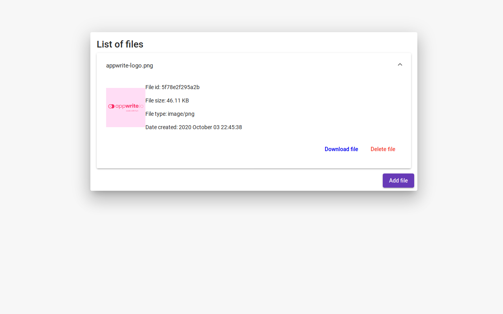

# Appwrite + Angular = ❤️

This example is to showcase [Appwrite's JS API](https://github.com/appwrite/sdk-for-js) with [Angular](https://angular.io/) by creating a file uploading application where you can upload files, see recently uploaded files, preview a file, download or delete files.

Please note that in this tutorial I'll only cover Appwrite specific parts.

## Sneak peek

This is what we will go through in details:



## Prerequisites

-   A Recent Version of NodeJS
-   Npm or yarn (I'll you npm for this tutorial for the sake of simplicity)
-   [A locally running appwrite instance](https://appwrite.io/docs/installation).
-   Create a user for testing

## Development server

Run `npm start` for a dev server. Navigate to `http://localhost:4200/`. The app will automatically reload if you change any of the source files.

> You can also change the port if `4200` is already in use with `npm start -- --port=4300`

## Getting Started

``` shell
git clone git@github.com:appwrite/demos-for-angular.git
cd file-upload-example
npm install
npm start
```

Open the folder with your favorite code editor.

## Setting project and backend url

Let's look at our `src/environments/environment.ts`, this is where Angular stores all of our environment variables, so here is where we set `project` and `endpoint` for Appwrite

Here is an example that I used:

```ts
export const environment = {
  production: false,
  endpoint: 'http://localhost/v1', // replace with your own appwrite server ip
  project: '5f7860217c7e7' // replace with your own appwrite project id
};
```

## Working with Appwrite

For working with Appwrite we will use a a service (`src/app/appwrite.service.ts`). Most of the service's methods is just a wrapper around Appwrite's SDK Storage API methods.   
I'll wrap every promise around an `Observable` to be consistent with Angular's built-in `HttpClient`.

### Detail about our service

#### Initializing the SDK

```ts
  // ...
  constructor() {
    this.sdk.setEndpoint(environment.endpoint);
    this.sdk.setProject(environment.project);
  }
  // ...
```

With this as soon as the service is creating the `endpoint` and `project` is also set and since our service is provided in root it will be only created once across the whole app. 

Removing and uploading a file requires a valid user session, we are only focusing on Storage API in this tutorial so we will use an already created user through the Appwrite console. __Please make sure__ to replace `email` and `password` in `dummyLogin` function.

#### Uploading a file

```ts
  public uploadFile(file: File): Observable<object> {
    return from(this.sdk.storage.createFile(file, ['*'], ['*']));
  }
```

We just need to pass through our `File` to upload and a set permissions. The first array is an array for `read` permissions, the second is for `write`. For this tutorial we wil use `*` (wildcard) which means this is available publicly. You can learn more about permissions [here](https://appwrite.io/docs/permissions).

#### Listing the files

```ts
  public listAllStorageFiles(): Observable<object> {
    return from(this.sdk.storage.listFiles(null, null, null, null));
  }
```

To list files you can pass more parameter for filtering, paging and ordering, but for this tutorial we will list everything.

#### Removing a file

```ts
  public removeFile(id: string): Observable<object> {
    return from(this.sdk.storage.deleteFile(id));
  }
```

To remove a file you only need to pass the file's `id`.

#### Previewing a file

```ts
  public previewFile(id: string): string {
    return this.sdk.storage.getFilePreview(id, 100, 100, null, 'fff', null);
  }
```

To preview a file you'll need the `fileId` and optionally you can also set `width`, `height`, `quality`, `backgroundColor` (hex code without `#`) and `output` to convert your file into your needs. For now we will request a `100×100` preview on a white background.

#### Downloading a file

```ts
  public downloadFileLink(id: string): string {
    return this.sdk.storage.getFileDownload(id);
  }
```

To get a download link we'll need the `fileId` and this will return a simple string that we can bind to an `a` tag `href` property.

### Closing words

#### Short app flow

1. App routing
2. List files routing
3. Pre-load files through `ListFilesResolver`
4. Render `ListFilesComponent`

Everything happens under `ListFilesComponent` for simplicity. After creating or removing a file we re-request all the files to show it correctly. 
Everything else is plain old Angular stuff and wiring together our created `AppwriteService`.

## Congratulations! 🥳 🥳 🥳

Give yourself a pat on the back, since you just successfully created a file upload web app using Appwrite and Angular! You should now have enough knowledge in order to use the Storage API with Appwrite and Angular and if you have any more questions do not hesitate to contact us on [Discord](https://discord.gg/ZFwqr3S) and if you notice any errors with this tutorial then feel free to raise an Issue or PR in the [GitHub of this tutorial](https://github.com/appwrite/demos-for-angular/).

Thank you for following the tutorial from all of us at the Appwrite Team.
